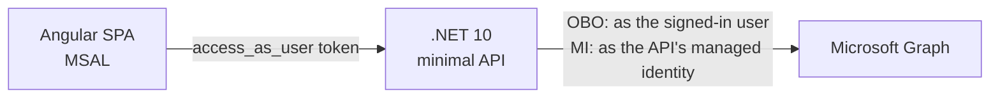

# AAGR — Angular → API → Graph Relay

A proof of concept for reading and editing Microsoft Graph directory data from a .NET API on behalf
of an Angular SPA, without ever handing the browser a Graph token. The browser signs the user in with
Entra ID and receives a token **only for the API**; the API decides what the caller may do and talks
to Graph.

The repo holds two self-contained implementations that differ in whose identity the API presents to
Graph. Each has its own SPA, API, Entra app registrations and container apps, so they can run side
by side. Both deploy to the same shared Azure resources in northcentralus: the `cae-shared`
Container Apps environment (logging to `law-shared`) in `rg-apps`, and the `acccrshared` registry
with the `id-shared-acrpull` pull identity in `rg-platform`. Each implementation adds only its own
user-assigned identities (`id-aagrobo-*` / `id-aagrmi-*`) and container apps in `rg-apps`.



| Implementation | Graph is called as | Graph permissions | Docs |
| --- | --- | --- | --- |
| [obo-imp](obo-imp) | the signed-in user, via the on-behalf-of flow | delegated, on the API app registration | [obo-imp/README.md](obo-imp/README.md) |
| [mi-imp](mi-imp) | the API's managed identity, app-only | application, on the managed identity | [mi-imp/README.md](mi-imp/README.md) |

**Choosing between them:** with OBO, Graph also enforces the caller's own directory rights, but the
API needs a confidential-client credential. With MI, the API holds no credential at all, but Graph
sees only the identity, so the API's authorization policies are the only per-user gate.

Each implementation folder has the same layout:

```text
<imp>/
├── README.md
├── infra/
│   ├── azure/   Bicep + deploy.ps1 (Azure Container Apps)
│   └── entra/   setup-entra.ps1 / teardown-entra.ps1 (app registrations)
└── src/
    ├── Poc.Api/  .NET 10 minimal API
    └── poc-web/  Angular 21 SPA
```
