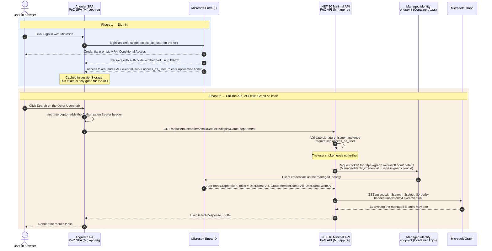
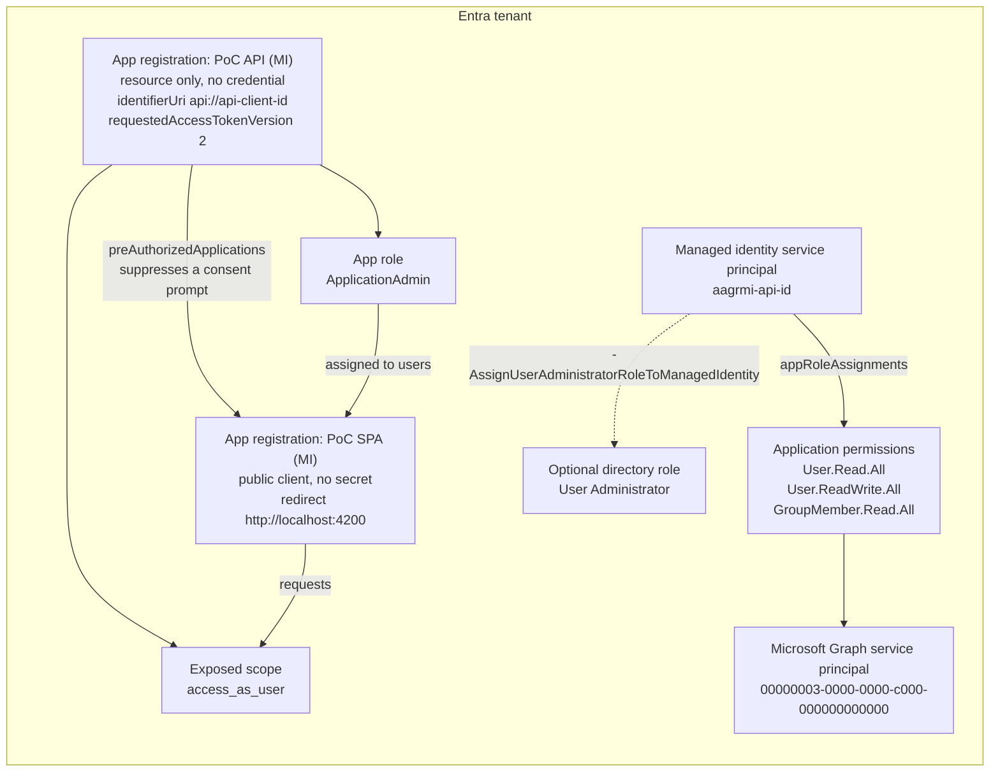
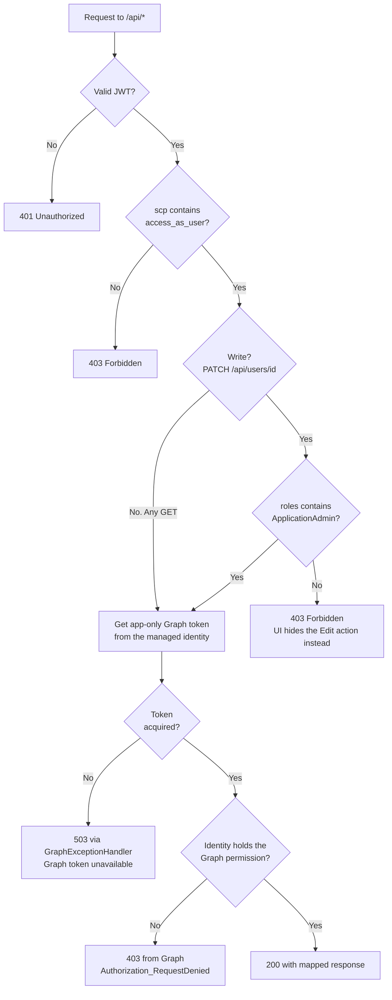

# AAGR — Managed identity implementation

The API calls Microsoft Graph **app-only as its own managed identity**. It validates the SPA's token
to decide who the caller is and what they may do, but never forwards that token: there is no
on-behalf-of exchange, no client secret and no federated credential. The browser never holds a Graph
token.

For the variant where the API calls Graph as the signed-in user, see [../obo-imp](../obo-imp/README.md).

| Path | Contents |
| --- | --- |
| [src/poc-web](src/poc-web) | Angular 21 SPA, `@azure/msal-browser`, no test framework |
| [src/Poc.Api](src/Poc.Api) | .NET 10 minimal API, `Microsoft.Identity.Web` for token validation, `Microsoft.Graph` + `Azure.Identity` for Graph |
| [infra/entra](infra/entra) | Azure CLI scripts that create the two app registrations and grant the managed identity its Graph permissions |
| [infra/azure](infra/azure) | Bicep and a deploy script that host both apps on Azure Container Apps |

The running app carries the same explanation on its **About** tab, which is reachable before you sign in.

> **Security trade-off.** Graph no longer evaluates the caller: every signed-in user with
> `access_as_user` reads the directory with the identity's rights, and the `CanEditUsers` policy
> (`ApplicationAdmin` role) is the only gate on `PATCH /api/users/{id}`.

## How it works

### Runtime flow



`GET /api/me` works the same way, except the API reads the caller's `oid` claim from the validated
token and calls `/users/{oid}`, because an app-only token has no `/me`. Locally the managed-identity
hop is replaced by `AzureCliCredential`, so Graph sees the `az login` account instead.

### Entra ID object model



The **PoC API (MI)** registration only describes the API to callers (scope and app role) and holds no
Graph permissions. The permissions belong to the managed identity's service principal, which is
created with the Azure resource rather than by `setup-entra.ps1`.

### Authorization gate on an inbound request



Things worth calling out:

- **`MapInboundClaims = false` is load bearing.** By default ASP.NET renames the `roles` claim to a
  long WS-Federation URI, which makes `RequireRole("ApplicationAdmin")` fail silently with a `403`
  even when the role is present in the token.
- **The API's policies are the only per-user gate.** Reads and writes use the same app-only token,
  so the `ApplicationAdmin` check is the only thing separating them. Graph's own `403` reflects the
  identity's grants, not the user's rights.

## Endpoints

| Route | Authorization | Graph call (as the managed identity) |
| --- | --- | --- |
| `GET /api/me/context` | `access_as_user` | none (reads token claims) |
| `GET /api/me` | `access_as_user` | `/users/{oid from token}` |
| `GET /api/me/groups` | `access_as_user` | `/users/{oid from token}/memberOf` |
| `GET /api/users/properties` | `access_as_user` | none (static catalog) |
| `GET /api/users?search=&top=` | `access_as_user` | `/users?$search=` |
| `GET /api/users/{id}` | `access_as_user` | `/users/{id}` |
| `GET /api/users/{id}/groups` | `access_as_user` | `/users/{id}/memberOf` |
| `PATCH /api/users/{id}` | `access_as_user` + `ApplicationAdmin` role | `PATCH /users/{id}` |

Query and route parameters are bound to `[AsParameters]` models in
[src/Poc.Api/Models/Requests.cs](src/Poc.Api/Models/Requests.cs) and validated by
`builder.Services.AddValidation()`. Failures return `400` with `ValidationProblemDetails`
before the endpoint body runs, which also keeps unvetted input out of the Graph `$search` expression.

## 1. Create the Entra ID app registrations

Requires **Application Administrator** to create the apps.

```powershell
az login --tenant <your-tenant-id>
cd mi-imp/infra/entra
./setup-entra.ps1 -AssignAdminRoleToCurrentUser -ApplyLocalConfig
```

What the script does:

1. Creates **PoC API (MI)** — exposes the `access_as_user` scope and defines the `ApplicationAdmin`
   app role. No client secret, no federated credential, no Graph permissions.
2. Creates **PoC SPA (MI)** — SPA redirect URI `http://localhost:4200`, permission to call
   `access_as_user`, and is pre-authorized on the API so users see a single consent prompt.
3. Grants admin consent for SPA → API.
4. `-AssignAdminRoleToCurrentUser` assigns you the `ApplicationAdmin` app role.
5. `-ApplyLocalConfig` writes the ids into `src/poc-web/src/environments/environment.ts` and stores
   the tenant id, client id and Graph endpoint in `dotnet user-secrets` (there is no secret to store).

Ids are also saved to `infra/entra/entra-output.json` (git-ignored). If you skip `-ApplyLocalConfig`,
copy [environment.sample.ts](src/poc-web/src/environments/environment.sample.ts) to `environment.ts`
and fill in the placeholders &mdash; the SPA will not build without it.

The managed identity does not exist until the first deploy, so its Graph permissions are granted in
[step 4](#4-deploy-to-azure). Remove the app registrations with `./teardown-entra.ps1`.

## 2. Run the API

```powershell
dotnet dev-certs https --trust    # once per machine
cd mi-imp/src/Poc.Api
dotnet run --launch-profile https
```

Listens on `https://localhost:7182`. OpenAPI document at `/openapi/v1.json` in Development.

There is no managed identity on a dev machine, so in `Development` the API uses `AzureCliCredential`
and Graph sees **your** `az login` account (delegated, limited by your own directory rights). The
app-only behaviour only exists once deployed.

## 3. Run the SPA

```powershell
cd mi-imp/src/poc-web
npm install
npm start
```

Open `http://localhost:4200`. The **About** tab explains the flow without signing in.

## 4. Deploy to Azure

Both apps run on Azure Container Apps (consumption plan, scale to zero), so an idle deployment costs
only the Basic container registry. Defined in [infra/azure/main.bicep](infra/azure/main.bicep).

| Resource | Notes |
| --- | --- |
| `aagrmi-api` container app | .NET API, 0.25 vCPU / 0.5 GiB, 0&ndash;1 replicas |
| `aagrmi-spa` container app | nginx serving the built SPA, same sizing |
| User-assigned managed identities | one per app; both pull from the registry (`AcrPull`), the API's also calls Graph |
| Container registry (Basic) | images are built in the registry with `az acr build`, no local Docker needed |
| Log Analytics workspace | container logs, 30-day retention |

Run step 1 first in the same cloud and tenant, then:

```powershell
cd mi-imp/infra/azure
./deploy.ps1                                  # defaults: rg-aagr-mi, eastus2
```

Then run the `setup-entra.ps1 -ManagedIdentityResourceId ...` command the script prints. It registers
the SPA URL and grants the identity these Microsoft Graph **application** permissions (needs
Privileged Role Administrator or Global Administrator):

| Permission | Used by |
| --- | --- |
| `User.Read.All` | `/api/me`, `/api/users` search and lookup |
| `GroupMember.Read.All` | `/api/me/groups`, `/api/users/{id}/groups` |
| `User.ReadWrite.All` | `PATCH /api/users/{id}` |

- Trim the list with `-ManagedIdentityGraphAppRoles`, e.g. drop `User.ReadWrite.All` for read-only.
- Add `-AssignUserAdministratorRoleToManagedIdentity` if edits must reach properties Graph protects
  behind a directory role (such as `mobilePhone`).
- Managed identity tokens are cached for up to 24 hours; restart the API revision after changing grants.

Sizing, region and replica count are parameters (`-Location`, `-ResourceGroup`, `-ContainerCpu`,
`-ContainerMemory`, `-MaxReplicas`, `-AcrSku`). For Azure Government, switch the CLI cloud and
re-run both steps there; the authority and Graph endpoint follow the cloud:

```powershell
az cloud set --name AzureUSGovernment; az login
./deploy.ps1 -Location usgovvirginia -ResourceGroup rg-aagr-mi-gov
```

- The first request after the apps scale to zero takes several seconds while a replica starts.
- Container Apps occasionally rejects new environments in a busy region
  (`ManagedEnvironmentCapacityHeavyUsageError`). The script stops on it; redeploy to another region
  with a new resource group.

## Configuration reference

`src/Poc.Api/appsettings.json` holds non-secret defaults; local values live in user-secrets and the
deployed values are set by the Bicep.

| Key | Value |
| --- | --- |
| `AzureAd:Instance` | Entra ID authority host for the cloud |
| `AzureAd:TenantId` | directory (tenant) id |
| `AzureAd:ClientId` | **PoC API (MI)** application (client) id, used only to validate inbound tokens |
| `MicrosoftGraph:BaseUrl` | Graph endpoint for the cloud; the `.default` scope is derived from it |
| `ManagedIdentity:ClientId` | user-assigned identity's client id; omit for a system-assigned identity |
| `Cors:AllowedOrigins` | origins allowed to call the API |

## Notes for moving beyond a PoC

- Grant the identity the narrowest Graph permissions the deployment needs; app-only permissions are
  tenant-wide.
- Consider restricting reads by role as well, since Graph no longer filters by the caller.
- The SPA stores tokens in `sessionStorage`; evaluate that against your threat model.
