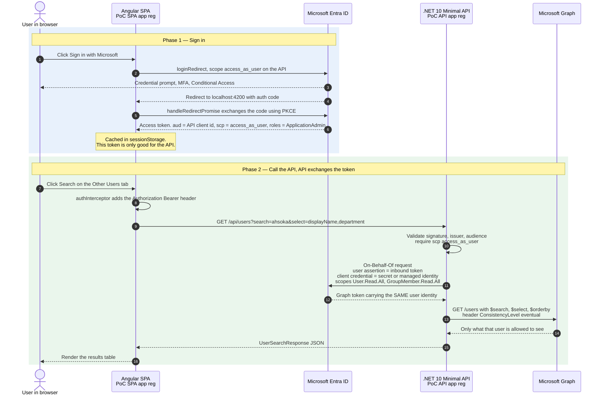
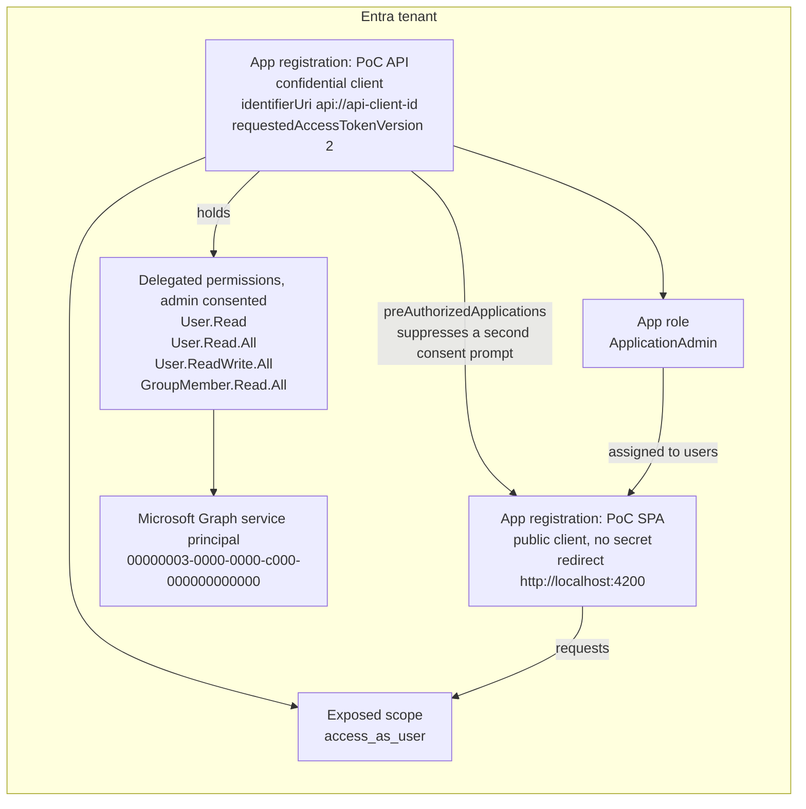
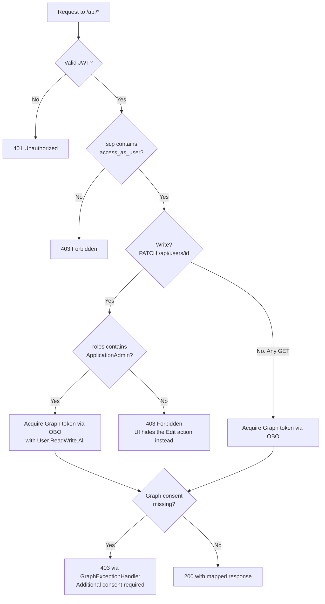

# AAGR — On-Behalf-Of implementation

The API calls Microsoft Graph **as the signed-in user**. It validates the SPA's token, exchanges it
through the on-behalf-of (OBO) flow for a delegated Graph token, and calls Graph with that. The
browser never holds a Graph token.

For the variant where the API calls Graph as its own managed identity, see [../mi-imp](../mi-imp/README.md).

| Path | Contents |
| --- | --- |
| [src/poc-web](src/poc-web) | Angular 21 SPA, `@azure/msal-browser`, no test framework |
| [src/Poc.Api](src/Poc.Api) | .NET 10 minimal API, `Microsoft.Identity.Web` with OBO token acquisition |
| [infra/entra](infra/entra) | Azure CLI scripts that create the two app registrations |
| [infra/azure](infra/azure) | Bicep and a deploy script that host both apps on Azure Container Apps |

The running app carries the same explanation on its **About** tab, which is reachable before you sign in.

## How it works

### Runtime flow



The point of the exchange in phase 2: the browser never holds a Graph token. If the SPA were
compromised, the stolen token only opens this API — an attacker cannot turn around and call Graph
directly with it.

### Entra ID object model



Both registrations are created by `setup-entra.ps1`. The SPA holds no secret and no Graph
permissions at all — every Graph permission lives on the API registration.

### Authorization gate on an inbound request



Things worth calling out:

- **`MapInboundClaims = false` is load bearing.** By default ASP.NET renames the `roles` claim to a
  long WS-Federation URI, which makes `RequireRole("ApplicationAdmin")` fail silently with a `403`
  even when the role is present in the token.
- **Reads are open, writes are gated.** Any signed-in user may search and read profiles, as they
  can in Outlook or Teams. `User.ReadWrite.All` is a *delegated* permission with tenant-wide admin
  consent, so the `ApplicationAdmin` check on `PATCH /api/users/{id}` is what stops ordinary users
  from reaching it. The write scope is requested only for that call, so read tokens stay read-only.
- **Graph still checks the user.** Delegated permissions are capped by the caller's own directory
  privileges, so editing another user also needs an Entra directory role such as
  **User Administrator**. Without one, Graph returns `403 Insufficient privileges`.

## Endpoints

| Route | Authorization | Graph call |
| --- | --- | --- |
| `GET /api/me/context` | `access_as_user` | none (reads token claims) |
| `GET /api/me` | `access_as_user` | `/me` |
| `GET /api/me/groups` | `access_as_user` | `/me/memberOf` |
| `GET /api/users/properties` | `access_as_user` | none (static catalog) |
| `GET /api/users?search=&top=` | `access_as_user` | `/users?$search=` |
| `GET /api/users/{id}` | `access_as_user` | `/users/{id}` |
| `GET /api/users/{id}/groups` | `access_as_user` | `/users/{id}/memberOf` |
| `PATCH /api/users/{id}` | `access_as_user` + `ApplicationAdmin` role | `PATCH /users/{id}` |

The by-id routes back the **Details** and **Edit** actions on each row of the search results in the
**Other Users** tab. The edit form sends display name, given name, surname, job title, department,
office and mobile phone; a blank field clears that property in the directory.

Query and route parameters are bound to `[AsParameters]` models in
[src/Poc.Api/Models/Requests.cs](src/Poc.Api/Models/Requests.cs) and validated by
`builder.Services.AddValidation()`. Failures return `400` with `ValidationProblemDetails`
before the endpoint body runs, which also keeps unvetted input out of the Graph `$search` expression.

## 1. Create the Entra ID app registrations

Requires **Application Administrator** to create the apps, and **Privileged Role Administrator**
(or Global Administrator) to grant admin consent.

```powershell
az login --tenant <your-tenant-id>
cd obo-imp/infra/entra
./setup-entra.ps1 -AssignAdminRoleToCurrentUser -ApplyLocalConfig
```

What the script does:

1. Creates **PoC API** — exposes the `access_as_user` scope, defines the `ApplicationAdmin`
   app role, requests the delegated Graph permissions `User.Read`, `User.Read.All`,
   `User.ReadWrite.All`, `GroupMember.Read.All`, and issues a client secret for the OBO exchange.
2. Creates **PoC SPA** — SPA redirect URI `http://localhost:4200`, permission to call
   `access_as_user`, and is pre-authorized on the API so users see a single consent prompt.
3. Grants admin consent for both registrations.
4. `-AssignAdminRoleToCurrentUser` assigns you the `ApplicationAdmin` app role.
5. `-ApplyLocalConfig` writes the ids into `src/poc-web/src/environments/environment.ts`
   and stores the tenant id, client id and client secret in `dotnet user-secrets`.

Ids are also saved to `infra/entra/entra-output.json` (git-ignored). Without
`-ApplyLocalConfig` the script prints the `dotnet user-secrets set` commands to run yourself.

`environment.ts` is git-ignored because its ids are tenant-specific. If you skip
`-ApplyLocalConfig`, copy
[environment.sample.ts](src/poc-web/src/environments/environment.sample.ts) to `environment.ts`
and fill in the placeholders &mdash; the SPA will not build without it.

To assign `ApplicationAdmin` to someone else: **Entra ID → Enterprise applications → PoC API →
Users and groups → Add user/group**. The role only appears in the token after the user signs in again.

Remove everything with `./teardown-entra.ps1`.

## 2. Run the API

```powershell
dotnet dev-certs https --trust    # once per machine
cd obo-imp/src/Poc.Api
dotnet run --launch-profile https
```

Listens on `https://localhost:7182`. OpenAPI document at `/openapi/v1.json` in Development.

## 3. Run the SPA

```powershell
cd obo-imp/src/poc-web
npm start
```

Open `http://localhost:4200`. The **About** tab explains the flow without signing in. Sign in, then
choose **Request my Entra info** on the **My Information** tab, or search on **Other Users**. If your
account holds the `ApplicationAdmin` role, an **Edit** action appears on each user's details.

## 4. Deploy to Azure

Both apps run on a shared Azure Container Apps environment (consumption plan, scale to zero) in
**northcentralus**. The deployment reuses existing shared resources and only adds this
implementation's identities and container apps. Defined in [infra/azure/main.bicep](infra/azure/main.bicep).

Shared resources (must already exist, referenced only):

| Resource group | Resource | Notes |
| --- | --- | --- |
| `rg-platform` | `acccrshared` container registry | images are built in the registry with `az acr build` as `aagrobo-api` / `aagrobo-spa`, no local Docker needed |
| `rg-platform` | `id-shared-acrpull` user-assigned identity | holds only `AcrPull` on `acccrshared`; attached to every container app and used for image pulls |
| `rg-apps` | `cae-shared` Container Apps environment | already sends container logs to `law-shared` |
| `rg-apps` | `law-shared` Log Analytics workspace | not referenced by the Bicep; wired through the environment |

Created in `rg-apps`:

| Resource | Notes |
| --- | --- |
| `id-aagrobo-api` user-assigned identity | federated credential on the API app registration, replaces the client secret for OBO; no registry access |
| `id-aagrobo-spa` user-assigned identity | the SPA's workload identity; no registry access |
| `ca-aagrobo-api` container app | .NET API, 0.25 vCPU / 0.5 GiB, 0&ndash;1 replicas; identities `id-aagrobo-api` + `id-shared-acrpull` |
| `ca-aagrobo-spa` container app | nginx serving the built SPA, same sizing; identities `id-aagrobo-spa` + `id-shared-acrpull` |

The per-app identities are user-assigned and live in `rg-apps` rather than being system-assigned, so
their ids &mdash; and the federated credential that trusts `id-aagrobo-api` &mdash; survive deleting
or replacing a container app. Registry access stays on the one narrowly scoped `id-shared-acrpull`.

The deploying account needs Contributor on `rg-apps`, permission to run `az acr build` on
`acccrshared`, and Managed Identity Operator on `id-shared-acrpull` (to attach it to the apps).
No role assignments are created.

Run step 1 first in the same cloud and tenant, then:

```powershell
cd obo-imp/infra/azure
./deploy.ps1                                  # defaults: rg-apps / rg-platform, northcentralus, prefix aagrobo
```

The script deploys the infrastructure, builds both images, builds the SPA against the deployed URLs
and deploys again with the images, printing per-resource status as it goes. On the **first** deploy,
run the `setup-entra.ps1` command it prints at the end: it registers the API's managed identity as a
federated credential and adds the SPA URL as a redirect URI. Re-running `deploy.ps1` later just ships
new images.

Sizing, replica count and the shared resource names are parameters (`-ContainerCpu`,
`-ContainerMemory`, `-MaxReplicas`, `-NamePrefix`, `-ResourceGroup`, `-ContainerAppsEnvironment`,
`-PlatformResourceGroup`, `-ContainerRegistry`, `-AcrPullIdentity`). `-Location` must match the
environment's region; the script checks it. For Azure Government, switch the CLI cloud, point the
script at that cloud's shared resources and re-run both steps there; the authority, Graph endpoint
and token-exchange audience follow the cloud:

```powershell
az cloud set --name AzureUSGovernment; az login
./deploy.ps1 -Location usgovvirginia -ResourceGroup rg-apps-gov -PlatformResourceGroup rg-platform-gov `
    -ContainerRegistry <gov-registry> -ContainerAppsEnvironment <gov-environment>
```

- The first request after the apps scale to zero takes several seconds while a replica starts.
- Removing the deployment means deleting `ca-aagrobo-api`, `ca-aagrobo-spa`, `id-aagrobo-api` and
  `id-aagrobo-spa` from `rg-apps` (and the `aagrobo-api` / `aagrobo-spa` repositories if wanted) &mdash; never the
  resource groups, which hold other apps.
- Re-running `setup-entra.ps1` resets the API client secret; keep `-ApplyLocalConfig` so local
  development picks up the new one.

## Configuration reference

`src/Poc.Api/appsettings.json` holds non-secret defaults; real values belong in user-secrets.

| Key | Value |
| --- | --- |
| `AzureAd:Instance` | Entra ID authority host for the cloud |
| `AzureAd:TenantId` | directory (tenant) id |
| `AzureAd:ClientId` | **PoC API** application (client) id |
| `AzureAd:ClientCredentials` | how the API proves its identity — see below |
| `MicrosoftGraph:BaseUrl` | Graph endpoint for the cloud |
| `MicrosoftGraph:Scopes` | delegated scopes requested during the OBO exchange |
| `Cors:AllowedOrigins` | origins allowed to call the API |

The API accepts v2 access tokens whose audience is either the API client id or
`api://<api-client-id>`; `Microsoft.Identity.Web` configures both, so no `Audience` entry is needed.

### Client credentials

The on-behalf-of flow requires a confidential client, so the API must hold a credential. Which one
depends on the environment, and `appsettings.json` deliberately declares none — an entry there would
merge with (rather than replace) the per-environment entry and leave a stale key behind.

| Environment | Credential | Where it comes from |
| --- | --- | --- |
| Local | client secret | `dotnet user-secrets`, written by `setup-entra.ps1 -ApplyLocalConfig` |
| Deployed | managed identity | `appsettings.Production.json`, no secret anywhere |

The deployed path uses a federated identity credential: the managed identity is registered on the app
registration, so it can act as the app without a secret or certificate to rotate. Create the identity
first, then register it:

```powershell
./setup-entra.ps1 -ConfigureFederatedCredential `
  -ManagedIdentityResourceId /subscriptions/<sub>/resourceGroups/rg-apps/providers/Microsoft.ManagedIdentity/userAssignedIdentities/id-aagrobo-api
```

The script resolves the identity's principal id (the federation subject) and client id, picks the
token-exchange audience for the active cloud, and prints the settings to apply to the deployed API.
Put the client id in `appsettings.Production.json`; for a **system-assigned** identity, pass
`-ManagedIdentityPrincipalId` instead and delete `ManagedIdentityClientId` from that file.

### Sovereign clouds

No endpoint is hard-coded. `setup-entra.ps1` reads the Graph endpoint and the Entra ID authority from
the CLI's active cloud, then writes them into `environment.ts` (`authorityHost`) and user-secrets
(`AzureAd:Instance`, `MicrosoftGraph:BaseUrl`). For Azure Government:

```powershell
az cloud set --name AzureUSGovernment
az login --tenant <tenant-id>
./setup-entra.ps1 -AssignAdminRoleToCurrentUser -ApplyLocalConfig
```

Pass `-GraphResourceUrl` / `-AuthorityHost` to override either value for a cloud the CLI does not
describe.

## Notes for moving beyond a PoC

- Replace the client secret with a certificate or workload identity federation
  (`AzureAd:ClientCredentials` supports both) — see [Client credentials](#client-credentials).
- Swap `AddInMemoryTokenCaches()` for a distributed cache.
- The SPA stores tokens in `sessionStorage`; evaluate that against your threat model.
